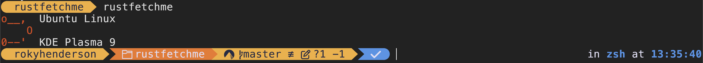

# RustFetchMe

<a href="https://codeberg.org/rhhen122/rustfetchme">CodeBerg</a>
<a href="https://github.com/rhhen122/rustfetchme">GitHub</a>



###
Install

```bash
git clone https://codeberg.org/rhhen122/rustfetchme.git
```

###
src/main.rs

```rust
// Linux
let mut os = "linux"; // Set a OS
let subsys = "ubuntu"; // Only for linux
let mut de = "KDE Plasma 9"; // A Desktop Enviroment
```
```rust
// MacOS
let mut os = "mac"; // Set a OS
let subsys = ""; // Only for linux
let mut de = ""; // A Desktop Enviroment
```

###
Compile

```bash
# Linux
cargo install --path .
```
```zsh
# MacOS ZSH
cat "/Users/YourUserHere/.cargo/bin" | cat ~/.zshrc -
```
```bash
# MacOS BASH
cat "/Users/YourUserHere/.cargo/bin" | cat ~/.bashrc -
```

###
Run with

```bash
rustfetchme
```